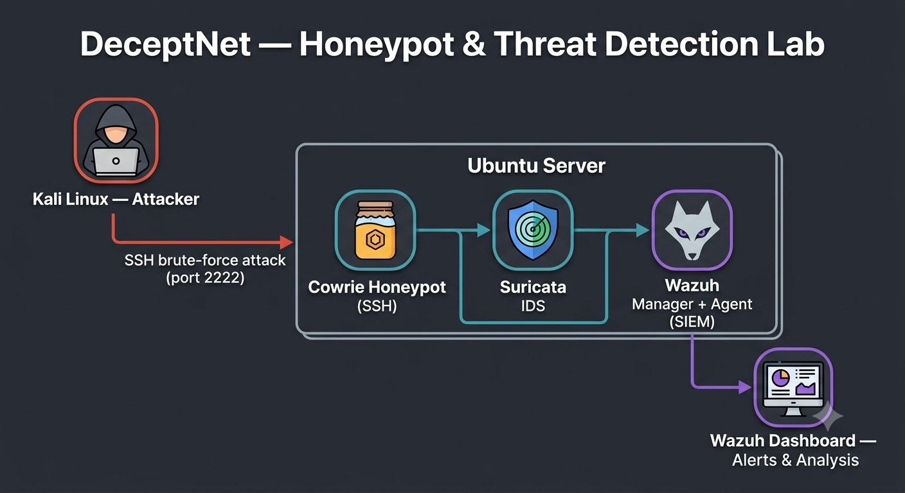
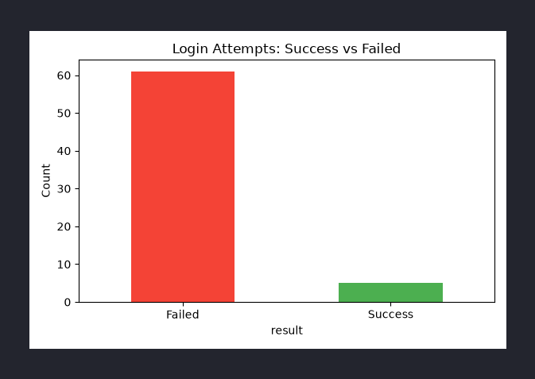
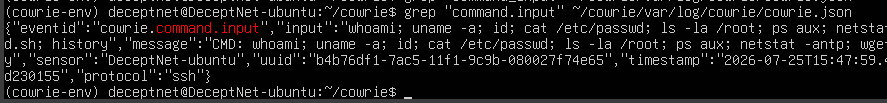
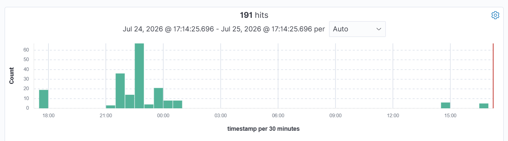
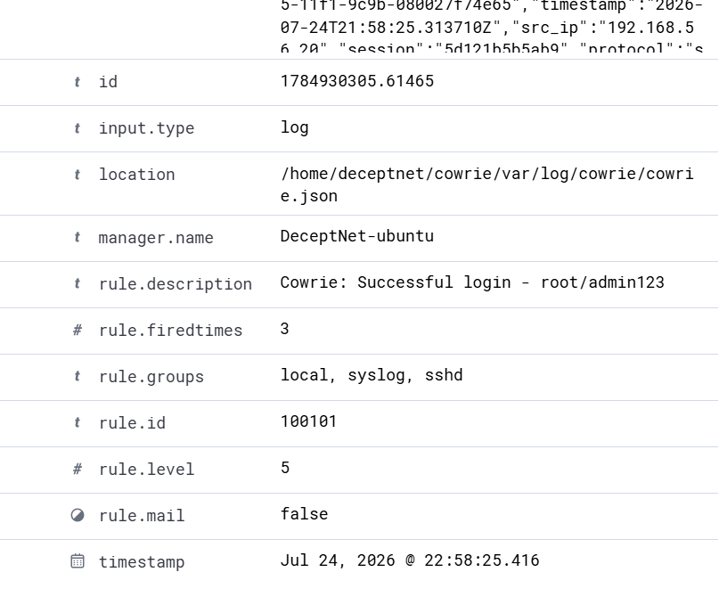
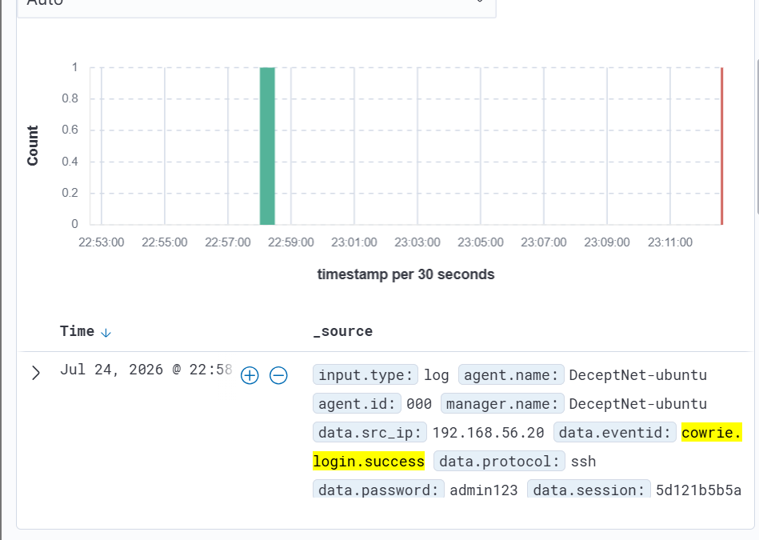
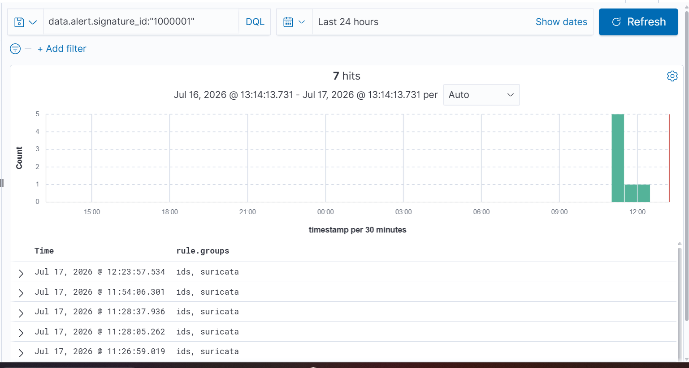
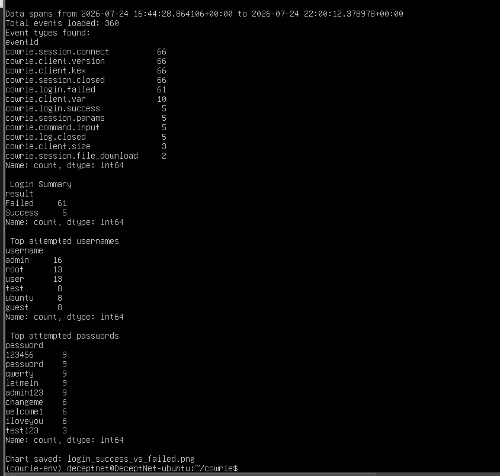

# DeceptNet: A Honeypot-Based Threat Detection & Attacker Behavior Analysis Lab
> A honeypot-based threat detection lab built to capture, detect, and analyze attacker behavior using real open-source security tools.

## Why I Built This Project
As a cybersecurity engineering student, I wanted to move beyond theoretical concepts and gain practical experience with the technologies used by security professionals.

I built DeceptNet to create a realistic security lab where I could safely simulate cyberattacks, capture malicious activity, and analyze attacker behavior using open-source security tools. The project allowed me to integrate a complete defensive monitoring pipeline—from attack simulation and honeypot deployment to log collection, SIEM correlation, and behavioral analysis.

Beyond learning how to configure tools such as Cowrie, Suricata, Wazuh, and Filebeat, my goal was to understand how security events are generated, correlated, and investigated in a real-world environment. This project also strengthened my skills in Linux administration, network security, log analysis, Python scripting, and detection engineering.

## Architecture



Kali performs simulated attacks against the Cowrie honeypot. Cowrie generates logs that are forwarded by Filebeat to Wazuh. Suricata monitors network traffic independently and sends alerts to Wazuh. Wazuh correlates both data sources while Python scripts analyze the captured attacker behavior.

## Tools Used

| Tool | Role |
|------|------|
| Cowrie | SSH honeypot — captures attacker sessions |
| Suricata | Network IDS — detects scans and suspicious traffic |
| Wazuh | SIEM — correlates alerts, custom detection rules |
| Filebeat | Log shipper — Cowrie logs → Wazuh pipeline |
| Python (pandas, matplotlib) | Attacker behavior analysis and visualization |
| Kali Linux | Attacker simulation machine |
| VirtualBox | Lab virtualization environment |

## Repository Structure

```text
DeceptNet/
│
├── docs/                      # Screenshots and architecture images
├── rules/
│   ├── suricata/
│   │   └── local.rules         # Custom Suricata IDS rules
│   └── wazuh/
│       └── local_rules.xml     # Custom Wazuh detection rules
├── scripts/
│   └── cowrie_analysis.py      # Python log analysis and visualization
├── diagram.png                 # Lab architecture diagram
├── requirements.txt            # Python dependencies
└── README.md
```

## Lab Environment

- **Ubuntu Server 22.04** — hosts Cowrie, Suricata, Wazuh Manager + Agent, Filebeat
- **Kali Linux** — attacker machine
- **VirtualBox** — Host-Only networking between VMs

## What It Does

- Lures attackers into a fake SSH server (Cowrie)
- Detects network scanning with custom Suricata rules
- Ships all logs to Wazuh via Filebeat
- Fires real-time alerts using custom Wazuh detection rules
- Analyzes attacker behavior and generates visual reports with Python

### Custom Wazuh Rules
| Rule ID | Event |
|---|---|
| 100100 | Base Cowrie honeypot event (parent rule, no alert) |
| 100101 | Cowrie login success |
| 100102 | Cowrie command input |
| 100103 | Cowrie session connect |

### MITRE ATT&CK Mapping
| Rule ID | Event | ATT&CK Technique | ID |
|---|---|---|---|
| 100101 | Cowrie login success | Valid Accounts | T1078 |
| 100102 | Cowrie command input | Command and Scripting Interpreter: Unix Shell | T1059.004 |

## Simulations

### 1. Brute-Force Attack
- **Tool:** Hydra
- **Target:** Cowrie SSH honeypot (port 2222)
- **Result:** 61 failed attempts, credential `root/admin123` discovered



### 2. Post-Compromise Session
After a successful login, the attacker ran recon commands inside the honeypot:

`whoami` `uname -a` `id` `cat /etc/passwd` `ls -la /root` `ps aux` `netstat -antp` `wget` `history`



All commands captured as `cowrie.command.input` events in Wazuh.



## Attacker Behavior Analysis

Using Python (pandas + matplotlib), Cowrie's JSON logs were parsed to:
- Count login attempts (success vs failure)
- Extract and frequency-rank every command executed post-compromise
- Identify attacker recon patterns: system enumeration → process listing → network recon → exfiltration attempt

## Key Findings

- Attacker used credential stuffing — 61 attempts before finding working credential
- Post-compromise behavior followed a classic recon pattern
- `wget` to external domain flagged as exfiltration attempt

## screenshots
### Wazuh Custom Rule 100101 — Cowrie Login Success Detected

*Custom Wazuh rule 100101 firing on successful honeypot login — root/admin123*

### Wazuh Discover — Cowrie Login Success Event

*Wazuh Discover showing cowrie.login.success event from Kali attacker machine*

### Wazuh — Suricata SYN Scan Detection

*Custom Suricata rule sid:1000001 detecting SYN scan — alert visible in Wazuh*

### Python Analysis Output


*Python script parsing Cowrie logs — 360 events, 61 failed logins, top usernames and passwords*
