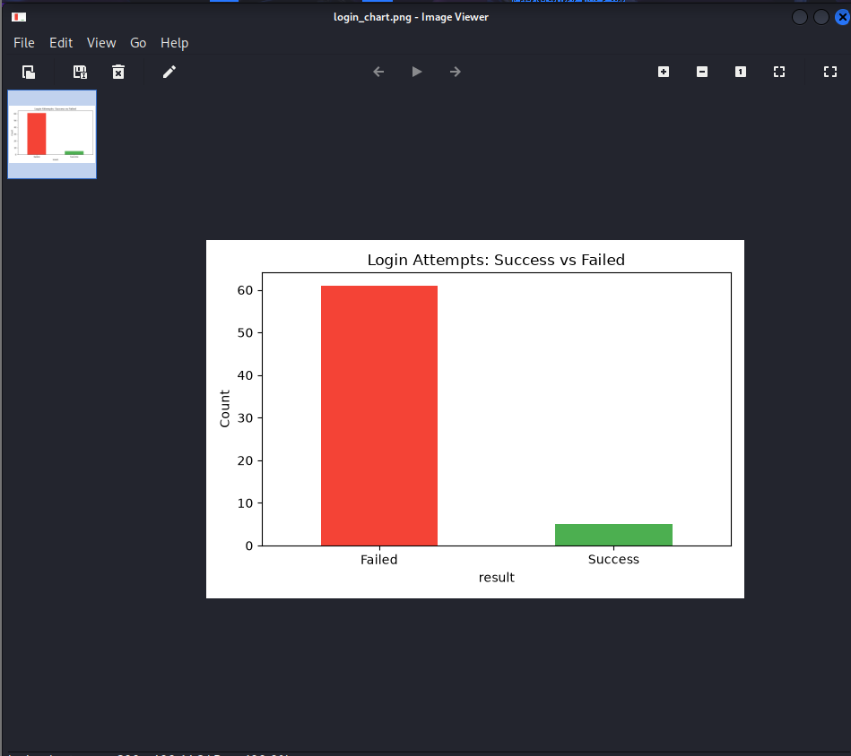
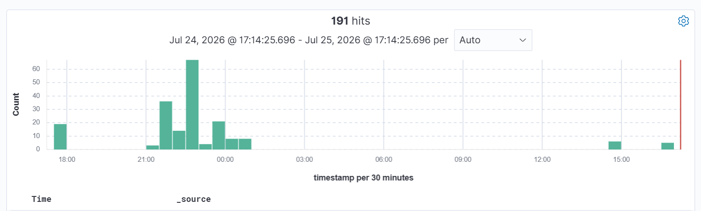

# Deceptnet
> A honeypot-based threat detection lab built to capture, detect, and analyze attacker behavior using real open-source security tools.

## Architecture

## Tools Used

| Tool | Role |
|------|------|
| Cowrie | SSH honeypot — captures attacker sessions |
| Suricata | Network IDS — detects scans and suspicious traffic |
| Wazuh | SIEM — correlates alerts, custom detection rules |
| Filebeat | Log shipper — Cowrie logs → Wazuh pipeline |
| Python (pandas, matplotlib) | Attacker behavior analysis and visualization |
| Kali Linux | Attacker simulation machine |
| VirtualBox | Lab virtualization environment |

## Lab Environment

- **Ubuntu Server 22.04** — hosts Cowrie, Suricata, Wazuh Manager + Agent, Filebeat
- **Kali Linux** — attacker machine
- **VirtualBox** — Host-Only networking between VMs

## What It Does

- Lures attackers into a fake SSH server (Cowrie)
- Detects network scanning with custom Suricata rules
- Ships all logs to Wazuh via Filebeat
- Fires real-time alerts using custom Wazuh detection rules
- Analyzes attacker behavior and generates visual reports with Python

## Custom Wazuh Rules

| Rule ID | Event |
|---------|-------|
| 100100 | Cowrie session connect |
| 100101 | Cowrie login success |
| 100102 | Cowrie login failed |
| 100103 | Cowrie command input |

## Simulations

### 1. Brute-Force Attack
- **Tool:** Hydra
- **Target:** Cowrie SSH honeypot (port 2222)
- **Result:** 61 failed attempts, credential `root/admin123` discovered

### 2. Post-Compromise Session
After a successful login, the attacker ran recon commands inside the honeypot:

`whoami` `uname -a` `id` `cat /etc/passwd` `ls -la /root` `ps aux` `netstat -antp` `wget` `history`

All commands captured as `cowrie.command.input` events in Wazuh.

## Attacker Behavior Analysis

Using Python (pandas + matplotlib), Cowrie's JSON logs were parsed to:
- Count login attempts (success vs failure)
- Extract and frequency-rank every command executed post-compromise
- Identify attacker recon patterns: system enumeration → process listing → network recon → exfiltration attempt

## Key Findings

- Attacker used credential stuffing — 61 attempts before finding working credential
- Post-compromise behavior followed a classic recon pattern
- `wget` to external domain flagged as exfiltration attempt

